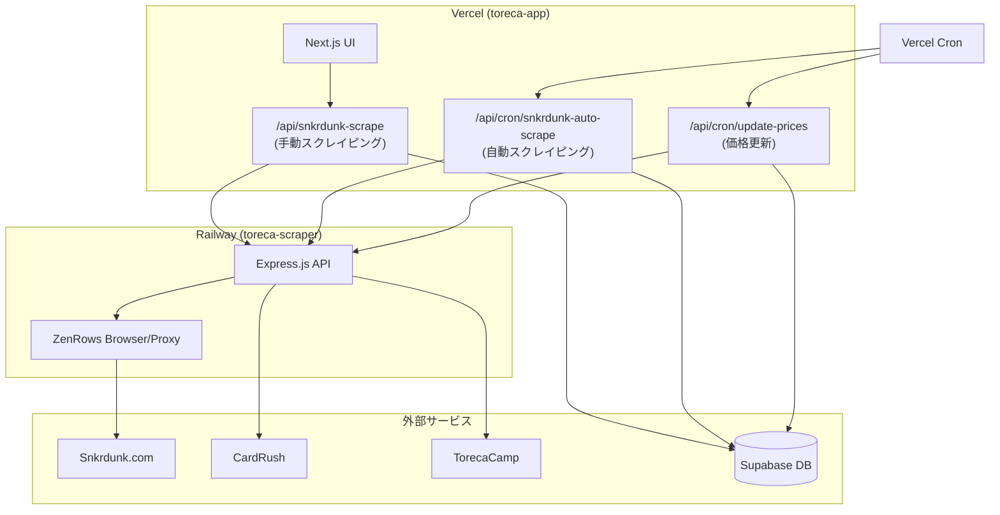

# Toreca App システムアーキテクチャ

> 最終更新: 2026-02-06  
> 安定版タグ: `stable-2026-02-06`

## リポジトリ構成

| リポジトリ | 用途 | ホスティング |
|---|---|---|
| `toreca-app` | Next.js Webアプリ + API | Vercel |
| `toreca-scraper` | スクレイピングサービス | Railway |

---

## データフロー



---

## スクレイピングの2種類

### 1. 手動スクレイピング (`/api/snkrdunk-scrape`)

| 項目 | 内容 |
|---|---|
| **トリガー** | ユーザーがUI上で「今すぐ更新」をクリック |
| **処理** | 単一カードの売買履歴を即時取得 |
| **ファイル** | `app/api/snkrdunk-scrape/route.ts` |
| **同期** | 同期処理（レスポンスでデータを返す） |

### 2. 自動スクレイピング (`/api/cron/snkrdunk-auto-scrape`)

| 項目 | 内容 |
|---|---|
| **トリガー** | Vercel Cron（10分ごと） |
| **処理** | 監視対象の全カードを順次スクレイピング |
| **ファイル** | `app/api/cron/snkrdunk-auto-scrape/route.ts` |
| **非同期** | ジョブID発行 → ポーリングで結果取得 |

### ⚠️ 重要: 両ファイルで共通のヘルパー関数が重複

以下の関数が両ファイルに存在（リファクタリング対象）:
- `parseRelativeTime()` - 日時パース
- `normalizeGrade()` - グレード正規化
- `parsePrice()` - 価格パース

---

## ファイル依存関係

### toreca-app (Next.js)

```
app/
├── api/
│   ├── snkrdunk-scrape/route.ts    # 手動スクレイピング
│   ├── cron/
│   │   ├── snkrdunk-auto-scrape/route.ts  # 自動スクレイピング ⭐
│   │   └── update-prices/route.ts         # 価格更新Cron
│   ├── scrape/route.ts             # 汎用スクレイピング（CardRush等）
│   └── recognize/route.ts          # AI画像認識
├── page.tsx                        # メインダッシュボード
└── ...

components/
├── CardDetail.tsx                  # カード詳細+グラフ表示
├── ImageRecognition.tsx            # AI画像認識UI
└── ...

lib/
└── supabase.ts                     # Supabaseクライアント
```

### toreca-scraper (Express.js)

```
index.js                            # 全機能が1ファイル
├── connectZenRowsBrowser()         # ZenRowsブラウザ接続
├── proxyFetch()                    # ZenRowsプロキシfetch（新機能）
├── lightFetch()                    # 直接fetch
├── browserSnkrdunk()               # Snkrdunk商品詳細
├── lightCardRush()                 # CardRush軽量版
├── doLightScrape()                 # 軽量スクレイピング実行
├── doBrowserScrape()               # ブラウザスクレイピング（Snkrdunk専用）
├── doScrape()                      # メインエントリーポイント
└── /scrape/snkrdunk-sales          # Snkrdunk売買履歴専用エンドポイント
```

---

## 環境変数

### toreca-app (Vercel)

| 変数 | 用途 |
|---|---|
| `SUPABASE_URL` | Supabase URL |
| `SUPABASE_ANON_KEY` | Supabase 匿名キー |
| `SUPABASE_SERVICE_ROLE_KEY` | Supabase 管理キー |
| `CRON_SECRET` | Cron認証用シークレット |
| `TORECA_SCRAPER_URL` | Railway scraper URL |

### toreca-scraper (Railway)

| 変数 | 用途 |
|---|---|
| `ZENROWS_API_KEY` | ZenRows認証キー |
| ~~`BROWSERLESS_TOKEN`~~ | ❌ 削除済み（2026-02-06） |

---

## スクレイピング方式（2026-02-06時点）

```
┌─────────────────────────────────────────┐
│          静的サイト (CardRush等)        │
│  1️⃣ 直接fetch (高速)                   │
│  2️⃣ 失敗時 → ZenRowsプロキシ (30秒)    │
└─────────────────────────────────────────┘

┌─────────────────────────────────────────┐
│          動的サイト (Snkrdunk)          │
│  ZenRowsブラウザ (JavaScript実行必須)   │
└─────────────────────────────────────────┘
```

---

## 復元方法

安定版に戻す場合:

```bash
# toreca-app
cd toreca-app
git checkout stable-2026-02-06

# toreca-scraper
cd toreca-scraper
git checkout stable-2026-02-06
```
