# Toreca App システムアーキテクチャ

> 最終更新: 2026-02-06  
> 安定版タグ: `stable-2026-02-06`

## リポジトリ構成

| リポジトリ | 用途 | ホスティング |
|---|---|---|
| `toreca-app` | Next.js Webアプリ + API | Vercel |
| `toreca-scraper` | スクレイピングサービス | Railway |

---

## データフロー

```mermaid
flowchart TB
    subgraph Vercel["Vercel (toreca-app)"]
        UI[Next.js UI]
        ManualAPI["/api/snkrdunk-scrape<br>(手動スクレイピング)"]
        CronAPI["/api/cron/snkrdunk-auto-scrape<br>(自動スクレイピング)"]
        UpdatePrices["/api/cron/update-prices<br>(価格更新)"]
    end
    
    subgraph Railway["Railway (toreca-scraper)"]
        Scraper[Express.js API]
        ZenRows[ZenRows Browser/Proxy]
    end
    
    subgraph External["外部サービス"]
        Snkrdunk[Snkrdunk.com]
        CardRush[CardRush]
        TorecaCamp[TorecaCamp]
        Supabase[(Supabase DB)]
    end
    
    UI --> ManualAPI
    Vercel_Cron[Vercel Cron] --> CronAPI
    Vercel_Cron --> UpdatePrices
    
    ManualAPI --> Scraper
    CronAPI --> Scraper
    UpdatePrices --> Scraper
    
    Scraper --> ZenRows
    ZenRows --> Snkrdunk
    Scraper --> CardRush
    Scraper --> TorecaCamp
    
    ManualAPI --> Supabase
    CronAPI --> Supabase
    UpdatePrices --> Supabase
```



---

## スクレイピングの2種類

### 1. 手動スクレイピング (`/api/snkrdunk-scrape`)

| 項目 | 内容 |
|---|---|
| **トリガー** | ユーザーがUI上で「今すぐ更新」をクリック |
| **処理** | 単一カードの売買履歴を即時取得 |
| **ファイル** | `app/api/snkrdunk-scrape/route.ts` |
| **同期** | 同期処理（レスポンスでデータを返す） |

### 2. 自動スクレイピング (`/api/cron/snkrdunk-auto-scrape`)

| 項目 | 内容 |
|---|---|
| **トリガー** | Vercel Cron（10分ごと） |
| **処理** | 監視対象の全カードを順次スクレイピング |
| **ファイル** | `app/api/cron/snkrdunk-auto-scrape/route.ts` |
| **非同期** | ジョブID発行 → ポーリングで結果取得 |

### ✅ 共通ヘルパー関数 (`lib/scraping/helpers.ts`)

以下の関数は共通モジュールに集約済み:
- `parseRelativeTime()` - 日時パース（相対/絶対対応）
- `normalizeGrade()` - グレード正規化（PSA/BGS/ARS/BOX対応）
- `parsePrice()` - 価格パース

---

## ファイル依存関係

### toreca-app (Next.js)

```
app/
├── api/
│   ├── snkrdunk-scrape/route.ts    # 🔵 Snkrdunk売買履歴（手動）
│   ├── cron/
│   │   ├── snkrdunk-auto-scrape/route.ts  # 🔵 Snkrdunk売買履歴（自動）⭐
│   │   └── update-prices/route.ts         # 🟢 販売価格更新（CardRush/TorecaCamp等）
│   ├── scrape/route.ts             # 🟢 汎用スクレイピング（販売価格/在庫）
│   └── recognize/route.ts          # AI画像認識
├── page.tsx                        # メインダッシュボード
└── ...

components/
├── CardDetail.tsx                  # カード詳細+グラフ表示
├── ImageRecognition.tsx            # AI画像認識UI
└── ...

lib/
├── config.ts                       # 環境変数・設定値集約
├── supabase.ts                     # Supabaseクライアント
├── scraping/
│   └── helpers.ts                  # スクレイピング共通関数
└── ai/
    └── gemini.ts                   # Gemini AI共通関数
```

#### データ種別の違い

| マーク | データ種別 | 対象サイト | 説明 |
|---|---|---|---|
| 🔵 | **売買履歴** | Snkrdunkのみ | 過去の取引履歴（日時、グレード、価格、アイコン番号） |
| 🟢 | **販売価格/在庫** | CardRush, TorecaCamp, Drasuta | 現在の販売価格と在庫数 |
| 🟠 | **販売価格/在庫** | **Snkrdunk** | 現在の最安値・在庫（`/api/cron/update-prices`経由） |

> ⚠️ **Snkrdunkは2種類のデータを取得**
> - 🔵 売買履歴: `snkrdunk-scrape`, `snkrdunk-auto-scrape`
> - 🟠 販売価格: `update-prices` → `toreca-scraper` の `browserSnkrdunk()`

### toreca-scraper (Express.js)

```
index.js                            # 全機能が1ファイル
├── connectZenRowsBrowser()         # ZenRowsブラウザ接続
├── proxyFetch()                    # ZenRowsプロキシfetch（新機能）
├── lightFetch()                    # 直接fetch
├── browserSnkrdunk()               # Snkrdunk商品詳細
├── lightCardRush()                 # CardRush軽量版
├── doLightScrape()                 # 軽量スクレイピング実行
├── doBrowserScrape()               # ブラウザスクレイピング（Snkrdunk専用）
├── doScrape()                      # メインエントリーポイント
└── /scrape/snkrdunk-sales          # Snkrdunk売買履歴専用エンドポイント
```

---

## 環境変数

### toreca-app (Vercel)

| 変数 | 用途 |
|---|---|
| `SUPABASE_URL` | Supabase URL |
| `SUPABASE_ANON_KEY` | Supabase 匿名キー |
| `SUPABASE_SERVICE_ROLE_KEY` | Supabase 管理キー |
| `CRON_SECRET` | Cron認証用シークレット |
| `TORECA_SCRAPER_URL` | Railway scraper URL |

### toreca-scraper (Railway)

| 変数 | 用途 |
|---|---|
| `ZENROWS_API_KEY` | ZenRows認証キー |
| ~~`BROWSERLESS_TOKEN`~~ | ❌ 削除済み（2026-02-06） |

---

## スクレイピング方式（2026-02-06時点）

```
┌─────────────────────────────────────────┐
│          静的サイト (CardRush等)        │
│  1️⃣ 直接fetch (高速)                   │
│  2️⃣ 失敗時 → ZenRowsプロキシ (30秒)    │
└─────────────────────────────────────────┘

┌─────────────────────────────────────────┐
│          動的サイト (Snkrdunk)          │
│  ZenRowsブラウザ (JavaScript実行必須)   │
└─────────────────────────────────────────┘
```

---

## 復元方法

安定版に戻す場合:

```bash
# toreca-app
cd toreca-app
git checkout stable-2026-02-06

# toreca-scraper
cd toreca-scraper
git checkout stable-2026-02-06
```
